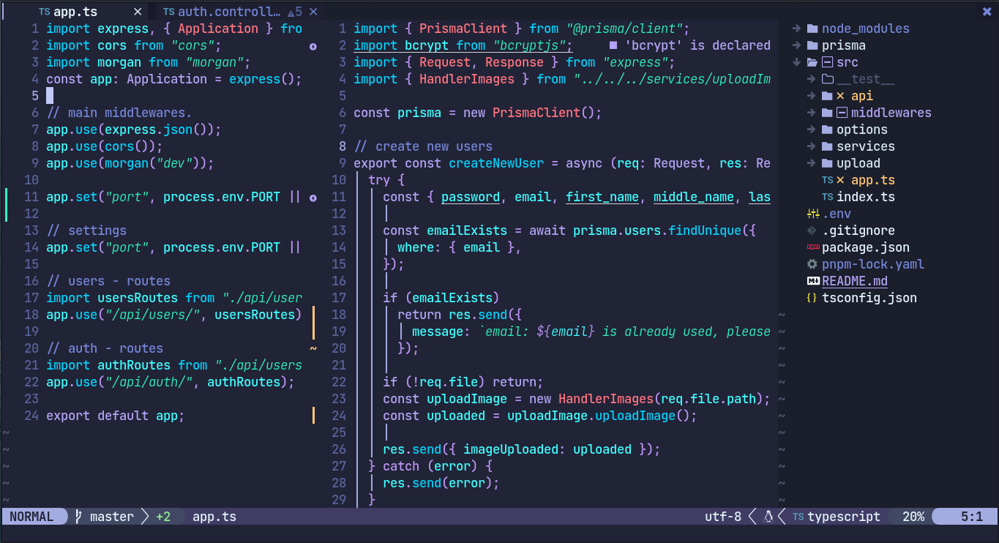
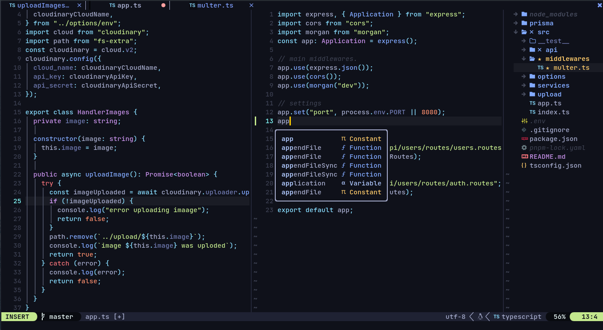

<div style="display: flex; justify-content: center; align-items: center">
  
  <h1>My Neovim config</h1>
</div>

<!-- # Neovim config -->
<!--  -->
<!--  -->
<!--  -->
<!-- > colorscheme: moonlight, font: JetBrains Mono -->
<!--  -->
<!-- I used to code in VSCode but I discovered neovim and immediately fell in love. VSCode is a such a good editor, but I felt something was not right, because when I installed some plugins, VSCode was very slow -->
<!--  -->
<!-- I'm trying to set up my neovim editor like an editor very powerfull, something like VSCode. -->
<!--  -->
<!-- I'm using -->
<!-- [packer.nvim](https://github.com/wbthomason/packer.nvim) -->
<!--  -->
<!-- Themes support with tree-sitter syntax hightlighting: -->
<!--  -->
<!-- Extensions for neovim: [Extensions](https://github.com/rockerBOO/awesome-neovim) -->

## I. Introduction

This is my Neovim configuration based in lua script (lua is better that vim script, trust me :sweat_smile:), I tried to emulate the Visual Studio Code UI (because I really like the VScode UI) but at same time I use all the Neovim performance.

### Why choose nvim?

I choose neovim because I do love the idea to leave behind the mouse and always use the keyboard for everything (I am a big fan of mechanical keyboards :smile:)
Also you can make your nvim editor as minimal as you can or you can take your editor to the next level of customization and make incredible features with lua script, that's something that in VsCode or another text editor I can't do

## DISCLAIMER :warning:

> - This is not Vscode, here nothing is easy to install and there will be moments that any plugin will crash, and you'll need to reserch and code to fix those errors.
> - This configuration is exclusively made for linux users, I think it might work in MacOs too, but I'm not sure.
> - Maybe something it could go wrong, I've been there a thousands of times.
> - If you want to get a nvim editor exactly as mine, you need to have installed my terminal (kitty) and my fonts (Jetbrains Mono)
> - You'll need to set up the LSP support and your formatters for all your languages (It's not too hard, don't worry)
> - If you love to code in JAVA, I don't know why the java LSP doesn't work.

## Installation:

First of all, please backup your current nvim config file:

```shell
mv ~/.config/nvim ~/.config/nvim-backup
```

1. Clone my entire dotfiles repository.

```shell
git clone https://github.com/freddyvelarde/dotfiles
cd dotfiles
```

Copy my nvim config file:

```shell
cp -r .config/nvim ~/.config
```

Once you're done, you can remove my repository from your machine.

```shell
cd ../ && rm -rf dotfiles
```

2. Install all the plugins just with one single vim command run `nvim ~/.config/nvim` and then press `:` in normal mode, run `:PackerSync`

## II. Features

- Session Project Manager
- Markdown live server
- LSP (support for many languages)
- Code autocompletation
- Colorschemes pre-installed with hightlighting support
- Hexadecimal color hightlighting (very useful for web develpers)

<!-- A. Built-in packages and commands -->
<!-- B. Modal interface -->
<!-- C. Customizable UI -->
<!-- D. Integration with plugins -->
<!-- E. Cross-platform compatibility -->
<!--  -->

## III. Plugins

You can add or remove all plugins you want in the next path `~/.config/nvim/lua/config/set-plugins.lua`.

<!-- A. Popular plugins -->
<!-- B. How to install plugins -->
<!-- C. How to manage plugins -->
<!--  -->

## IV. Keymaps

I recomend you to learn if you don't know the [Vim Vanilla keybindings](https://gist.github.com/hansrajdas/6520d74ac3251552e66a76f2f32b4bdd).

> My leader keymap is the space key, if you want to edit or add your own keymaps you can edit any of these keymap in the next path: `~/.config/nvim/lua/config/core/keymaps.lua`

### My custom keybindings:

Basic keymaps:

| keymap      | Mode   | Action                              |
| ----------- | ------ | ----------------------------------- |
| jk          | insert | switch to normal mode               |
| rr          | normal | select a entire line of code        |
| ii          | visual | exit the select code in visual mode |
| leader + s  | normal | save the current file               |
| leader + nh | normal | clear search highlights             |
| leader + fw | normal | find a hovered word                 |
| control + a | normal | select the entire file              |

Move lines of code:
| keymap | Mode | Action |
| ----------- | ------ | ----------------------------------- |
| alt + j | normal | move to down a entire line of code |
| alt + k | normal | move to up a entire line of code |
| alt + K | visual | move to up a entire block of code |
| alt + J | visual | move to down a entire block of code |

Nvim tree:

| keymap     | Mode   | Action                             |
| ---------- | ------ | ---------------------------------- |
| leader + b | normal | toggle the nvim-tree file explorer |

Tmux windows spliter:
| keymap | Mode | Action |
| ----------- | ------ | --------------------------------------- |
| leader + sv | normal | split window vertically |
| leader + sh | normal | split window horizontal |
| leader + se | normal | make split windows equal width & height |
| leader + sx | normal | close window splited |

Tmux moves:
| keymap | Mode | Action |
| ----------- | ------ | --------------------------------------- |
| leader + h | normal | move to left window |
| leader + l | normal | move to right window|
| leader + k | normal | move to up window|
| leader + j | normal | move to down window|

Windows splited resize:
| keymap | Mode | Action |
| ----------- | ------ | --------------------------------------- |
| leader + fh | normal | increse vertical size |
| leader + fl | normal | decrese vertical size|
| leader + fk | normal | increse horizontal size|
| leader + fj | normal | decrese horizontal size|
| leader + sm | normal | maximize a splited window|

Telscope keymaps:
| keymap | Mode | Action |
| ----------- | ------ | --------------------------------------- |
| leader + ff | normal | Open telescope files finder |
| leader + fb | normal | Open telescope files buffer |
| leader + fg | normal | Open telescope grep |

Comments:
| keymap | Mode | Action |
| ----------- | ------ | --------------------------------------- |
| gc | normal & visual | to comment a line or a block of code (recommended) |
| control + / | normal & visual | if you really like vscode's ways to comment code |

Tabs moves:
| keymap | Mode | Action |
| ----------- | ------ | --------------------------------------- |
| alt + . | normal | next tab |
| leader + w | normal | next tab |
| alt + , | normal | previous tab |
| leader + q | normal | previous tab |
| alt + x | normal | close tab |
| leader + x | normal | close tab |

To preview Markdown run `:MarkdownPreview`

### Surroundings:

It's easiest to explain with examples. Press cs"' inside:
`"Hello world!"` to change it to `'Hello world!'`

> This is an external plugin if you want to know more, visit [this](https://github.com/tpope/vim-surround)

Also if you want to surrounding a entire sentence you can select your sentence and press `"`, `'`, `{`, `[`, `(`Example: Select the sentence`hello world`in visual mode press " and you'll get`"hello world"`

## LSP

LSP (Languages protocol server) allows us to improve the coding performance, another tool like this is `nvim-coc` but I prefer to configure it by myself.

### How to install a programming language server?

There's a tool called [Mason](https://github.com/williamboman/mason-lspconfig.nvim) that makes my life easier, Mason install a LSP, formatter, linter for a programming language for you.
you just need to setup the config for your favorite programming language and that's it.

## Colorschemes gallery

I got installed some colorschemes, you can remove or add your favorite colorscheme.

To switch colorschemes I have a python script that makes that easier called [pykitty](https://github.com/freddyvelarde/pykitty)

> If you going to install a colorscheme make sure that it's compatible with tree-sitter highlights support. [themes](https://github.com/nvim-treesitter/nvim-treesitter/wiki/Colorschemes)

- [Material Ocean](https://github.com/marko-cerovac/material.nvim) (by default)
  
- [Moonlight](https://github.com/shaunsingh/moonlight.nvim)
  
- [Oceanic next](https://github.com/mhartington/oceanic-next)
  
- [Onedark DARK](https://github.com/olimorris/onedarkpro.nvim)
  
- [Pinkmare](https://github.com/Matsuuu/pinkmare)
  
- [Tokyo night](https://github.com/folke/tokyonight.nvim)
  

## Future features:

- I want to add folding code, like Vscode, if I don't find one, I will code it by myself.
- I also want to make a auto set-up for LSP.

## Special thanks to:

My config is based in [Josean's youtube tutorial](https://www.youtube.com/watch?v=vdn_pKJUda8&t=3659s)

## Some tips:

- use `zz` to center your code.
- watch this [video](https://www.youtube.com/watch?v=o4X8GU7CCSU&t=171s) if you're a beginner users.
- If you want to edit some options like the _relative numbers_, edit this file `~/.config/nvim/lua/config/core/options.lua`

### Conclusion:

I hope this helps you to get a cool neovim config, If you have an issue you can contact me through reddit or open a github issue (if it could be do)

> if you have installed my config and everything went good, please follow me on github, that makes me happy :heart:

<!-- A. Default keybindings -->
<!-- B. How to customize keybindings -->
<!-- C. Keymaps for plugins -->
<!--  -->
<!-- V. Getting Started -->
<!-- A. Installation -->
<!-- B. Basic usage -->
<!-- C. Configuration -->
<!--  -->
<!-- VI. Conclusion -->
<!-- A. Summary of features -->
<!-- B. Comparison with other editors -->
<!-- C. Final thoughts -->
