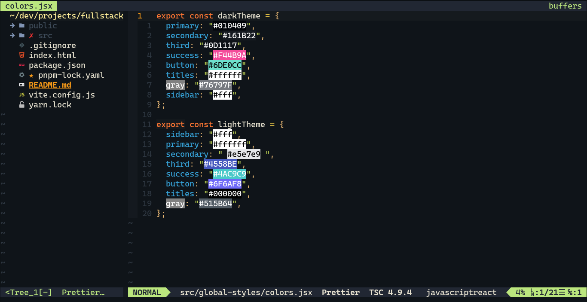

# My linux settings


## I use VIM btw



## VSCODE SNIPPETS:

- Error Lens
- ES&+ Reactjs
- ESLint
- GO
- Material Icons
- Prettier Code Formatter
- Python
- RapidAPI Cli
- TSLint
- vscode-styled-components

## VSCODE SETTINGS:

```json
{
  "editor.fontFamily": "'Cascadia Code', 'Droid Sans Mono', 'monospace', monospace",
  "editor.fontLigatures": true,
  "workbench.iconTheme": "material-icon-theme",
  "workbench.colorTheme": "Ocean Space",
  "editor.tabSize": 2,

  "editor.cursorStyle": "line",
  "editor.autoIndent": "advanced",
  // "editor.activ": "",
  "editor.cursorWidth": 2,
  // "editor.cursorBlinking": "solid"
  "workbench.colorCustomizations": {
    "editorCursor.foreground": "#ffff00",
    "terminalCursor.foreground": "#ffff00"
  },
  "editor.defaultFormatter": "esbenp.prettier-vscode",
  "[python]": {
    "editor.defaultFormatter": "ms-python.python"
  },
  "python.formatting.blackArgs": ["--line-length", "120"],
  "python.formatting.provider": "black",

  "editor.formatOnSave": true,
  "[javascript]": {
    "editor.defaultFormatter": "esbenp.prettier-vscode"
  },
  "workbench.statusBar.visible": false,
  "editor.minimap.renderCharacters": false,
  "editor.minimap.enabled": false,
  "editor.renderWhitespace": "none",
  "explorer.confirmDelete": false,
  "tabnine.experimentalAutoImports": true,
  "editor.tokenColorCustomizations": {
    "[Dark Horizon]": {
      "comments": "#05d5c785"
      // "variables": "#42aa1d"
    }
  },
  "window.zoomLevel": 2
}
```

# My tools

- Qtile window manager
- Snap ( package manager like pacman )
-
