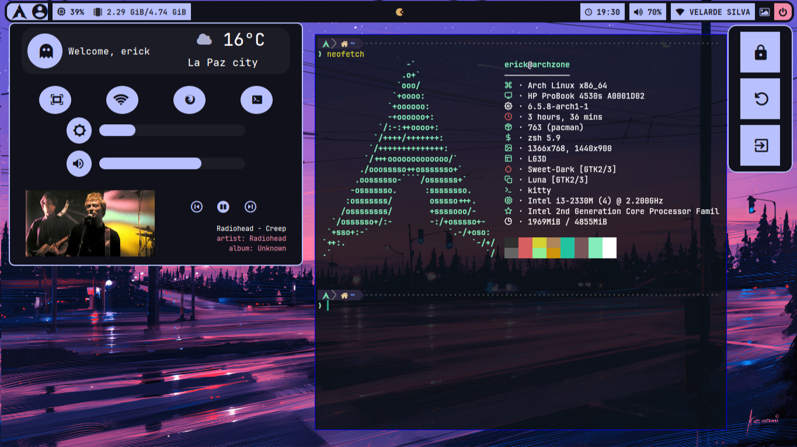
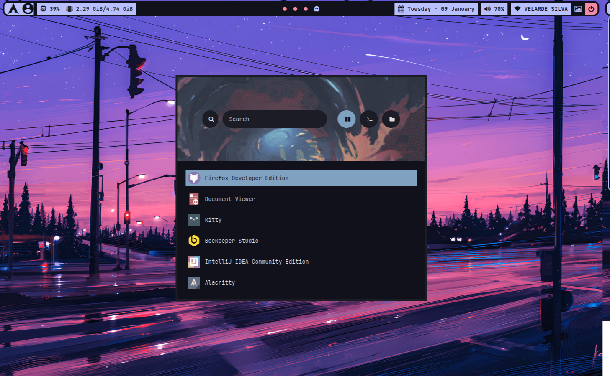

# My linux config

This repo contains my own code and code from others repositories like:

- [gh0stzk's dotfiles](https://github.com/gh0stzk/dotfiles/)
- [AlphaTechnolog's dotfiles](https://github.com/AlphaTechnolog/dotfiles/)
- [Archcraft Qtile](https://github.com/archcraft-os/archcraft-qtile)

## Disclaimer - Warning!!!

> All my config code is for my needs. I use two monitors: 1366x768, 1440x900
> If you like this config or you will use some of my code, please give this repo a star :).

Main monitor:

External monitor:


## My tools:

- OS: _Arch Linux_
- Window manager: _Qtile_
- Terminal: _Kitty_
- Shell: _Zsh_
- Editor: _Neovim_ (My own config)
- App launcher: _Rofi_
- Main Font: _Jetbrains Mono_
- Bar: _Polybar_
- Widgets library: _Eww_

## I use VIM btw


> My config is not pretty amazing, but I recommend you
> use vim (neovim) if you're a linux user and even if you're not
>
> If you're interested, all my nvim config is [here](https://github.com/freddyvelarde/dotfiles/tree/master/cfg/nvim)
> in lua script and vim script.

<!-- # LINKS -->
<!--  -->
<!-- - [install bat](https://www.linode.com/docs/guides/how-to-install-and-use-the-bat-command-on-linux/) -->
<!-- - [Install docker](https://www.linuxfordevices.com/tutorials/linux/install-docker-on-arch) -->

<!-- # TIPS -->
<!--  -->
<!-- use the next command to git terminal -->
<!--  -->
<!-- ```shell -->
<!-- git config --global user.name "" -->
<!-- git config --global user.email "" -->
<!--  -->
<!-- git config --global credential.helper store -->
<!--  -->
<!-- # config your user and password -->
<!-- ``` -->

<!-- # Install -->
<!--  -->
<!-- ```sh -->
<!-- git clone https://github.com/freddyvelarde/dotfiles.git ~/.dotfiles -->
<!-- ``` -->

## Documentation:

[Archlinux BIOS Installation](https://github.com/freddyvelarde/dotfiles/blob/master/docs/arch-installation-guide.md)

# My fonts

- [Cascadia Code](https://www.nerdfonts.com/font-downloads)
- [JetBrain Mono](https://www.nerdfonts.com/font-downloads)
- [Caskaydia Code](https://www.nerdfonts.com/font-downloads)
