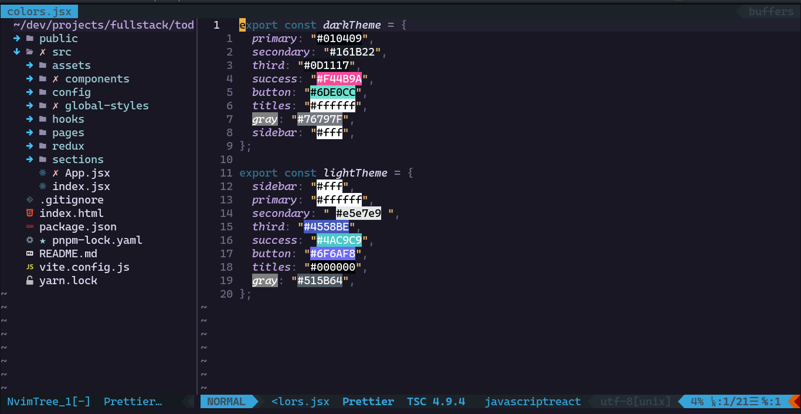

# My linux settings

> if you want to know how did I convert my pic into text visit [this](https://github.com/TheZoraiz/ascii-image-converter)

## I use VIM btw

> My config is not pretty amazing, but I recommend you
> to use vim (neovim) if you're a linux user and even if you're not
>
> If you're interested, all my nvim config is [here](https://github.com/freddyvelarde/dotfiles/tree/master/.config)
> in lua script and vim script.

# My tools

- Qtile window manager
- Snap _(package manager like pacman)_
- rofi
- nvim (PDE)
- Kitty terminal
