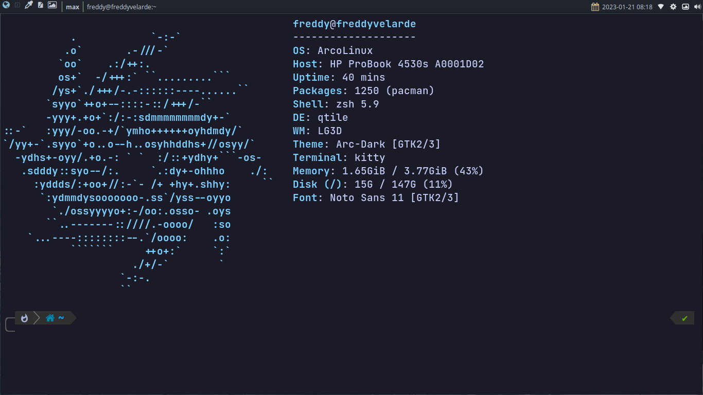

# My linux settings

As you can see my poor machine only supports linux, but I can do everything I need



## I use VIM btw


> My config is not pretty amazing, but I recommend you
> use vim (neovim) if you're a linux user and even if you're not
>
> If you're interested, all my nvim config is [here](https://github.com/freddyvelarde/dotfiles/tree/master/.config/nvim)
> in lua script and vim script.

# My tools

- Qtile window manager
- Snap _(package manager like pacman)_
- rofi
- nvim (PDE)
- Kitty terminal

# LINKS

- [install bat](https://www.linode.com/docs/guides/how-to-install-and-use-the-bat-command-on-linux/)
- [Install docker](https://www.linuxfordevices.com/tutorials/linux/install-docker-on-arch)

# TIPS

use the next command to git terminal

```shell
git config --global user.name ""
git config --global user.email ""

git config --global credential.helper store

# config your user and password
```

# Install

```sh
git clone https://github.com/freddyvelarde/dotfiles.git ~/.dotfiles
```

# My fonts

- [Cascadia Code](https://www.nerdfonts.com/font-downloads)
- [JetBrain Mono](https://www.nerdfonts.com/font-downloads)
- [Caskaydia Code](https://www.nerdfonts.com/font-downloads)
